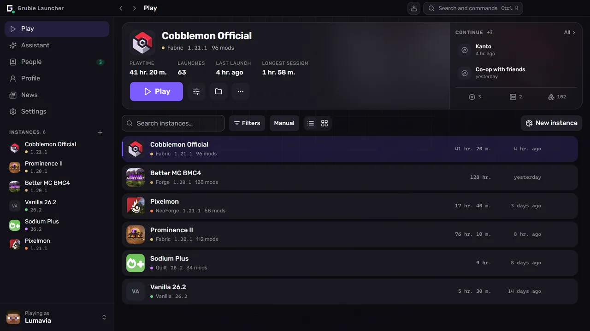
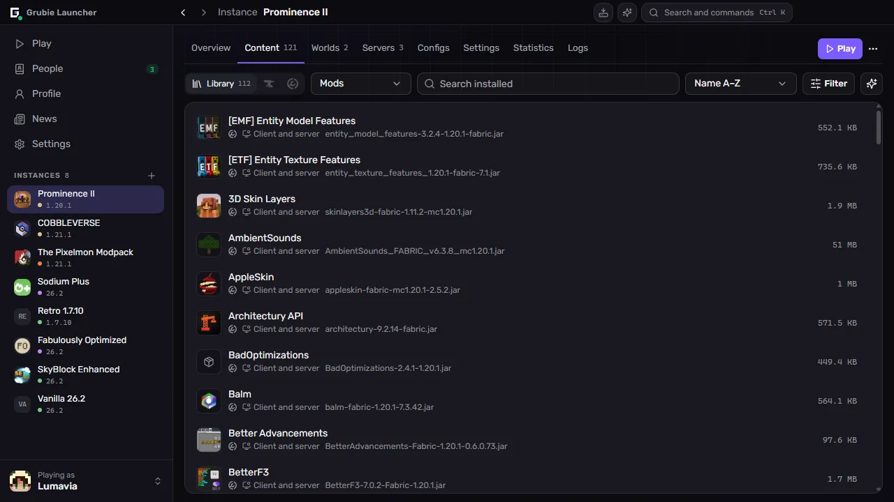
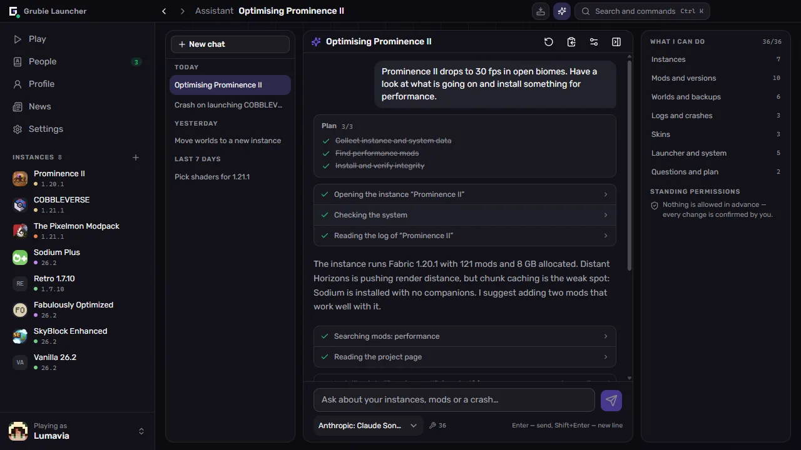
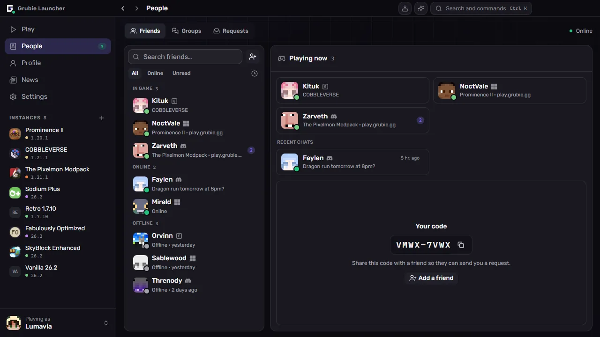

  

  <a href="https://grubielauncher.com/">grubielauncher.com</a>

  
  
  
   
  

---

# Grubie Launcher

A desktop Minecraft launcher for Windows and Linux. It installs game versions and mod loaders, downloads the matching Java itself, and keeps every instance — mods, worlds, configs, launch settings — in one place. Two things set it apart from a plain launcher: when the game crashes it reads the report and tells you what broke, and your friends live in the same window — chat, voice, and joining each other's worlds without port forwarding or a rented server.

The interface is a permanent sidebar with full screens instead of stacked dialogs. <kbd>Ctrl</kbd>+<kbd>K</kbd> opens a command palette that reaches any instance, screen or setting, <kbd>Ctrl</kbd>+<kbd>I</kbd> opens the assistant, and <kbd>Alt</kbd>+<kbd>←</kbd> / <kbd>Alt</kbd>+<kbd>→</kbd> walk the history like a browser.

<kbd></kbd>
<kbd></kbd>

# Screenshots

**The library, and the instance you played last**

**Mods, resource packs and shaders, searched inside the launcher**

**An assistant that reads your instances, logs and crashes**

**Friends, groups and requests, next to the chat**

# Features

### Play

- Official Minecraft versions: releases, snapshots and old alpha/beta builds.
- Mod loaders: **Forge**, **NeoForge**, **Fabric**, **Quilt**.
- Java is downloaded automatically and matched to the game version.
- Accounts: **Microsoft**, **Ely.by**, **Discord** and offline. Several at once, switched from the sidebar.
- Instance library with list and grid views, groups, tags and notes.
- Continue where you left off: launch straight into a world or onto a server from the instance screen.
- Memory, JVM flags and process priority are set globally and can be overridden per instance.
- A desktop shortcut can be created for a single instance.

### Instances

- Mods, resource packs, shaders and datapacks from **CurseForge** and **Modrinth**, searched and installed inside the launcher.
- Update check that shows a diff first: what gets added, updated and removed.
- Import from a file: Grubie, CurseForge, Modrinth (`.mrpack`), Prism and MultiMC packs — drag the archive onto the window.
- Export an instance to an archive; the copy carries mods, configs and worlds.
- Publish an instance and share the code: everyone who installed it sees your next update, with a diff of what changes, and syncs it in one click.
- Community catalog of public instances, both inside the launcher and on [grubielauncher.com/packs](https://grubielauncher.com/packs).
- Integrity check that re-downloads damaged or missing files.
- Config editor with search, completion and saved versions to roll back to.

### Together

- Friends, friend requests, direct messages and group chats.
- Voice: rooms inside groups and one-to-one calls, push-to-talk, noise suppression, per-participant volume.
- **Play together** — open the world you are in to friends or to everyone, over the internet, without port forwarding.
- Join a friend's world in one click: the launcher installs and syncs their instance, then connects you.
- Game invites; Telegram notifications reach you while the launcher is closed.
- Discord Rich Presence with the instance you are playing.
- Profile with achievements, statistics and a leaderboard. Achievements count on a friend's shared world too.
- Skins and capes: your own wardrobe, import by file, link or nickname, plus a community catalog you can publish to.

### When something goes wrong

- Crash card: the launcher reads the crash report, names the likely culprit and what to do about it. The rules come from the server, so they improve without a launcher update.
- AI crash analysis for crashes the rules do not recognise — opt-in, and the log is stripped of paths, nicknames and tokens before it is sent.
- Run history: every launch with its log, search, exit code, and a one-click report to paste when asking for help.
- World backups: automatic after a session and manual, with a safety copy taken before any restore.
- Connection test against the launcher's own services and the official Minecraft, CurseForge and Modrinth endpoints — useful when a provider blocks something.
- Task center: installs and updates with progress, per-file errors and retry.
- Downloads can go through the Grubie mirror and fall back to the official source on their own.

### Assistant

- Runs on **your** provider and **your** key: any OpenAI-compatible endpoint, OpenRouter by default. The key stays on your machine.
- Reads what it needs to answer: instances, installed mods, logs, the last crash, worlds, accounts, disk usage, system information.
- Acts on your behalf: creates instances, installs, updates, disables and removes mods, changes memory and launch arguments, backs up and restores worlds, picks a skin, launches the game.
- Asks before it changes anything, and asks again every time for deletions — no matter what you allowed earlier.
- Chat history syncs to your Grubie account; the sync can be turned off in the settings.

### Your own server

- Create a server next to an instance: **Vanilla**, **Spigot**, **Bukkit**, **Paper**, **Purpur**, **Forge**, **NeoForge**, **Fabric**, **Quilt**.
- Console, `server.properties` editor, and the server picks up the mods and configs of the instance it belongs to.

# Installation

1. Download the latest build from [Releases](https://github.com/MOJI6416/grubielauncher/releases).
2. **Windows** — run the `-setup.exe` installer. **Linux** — run the `.AppImage`, or install the `.deb`.
3. Sign in with an account, or create an offline one, and pick a version.

The launcher updates itself; new versions arrive without a re-install.

# License

**MIT** — see [LICENSE](LICENSE).

# Links

- **Website:** [grubielauncher.com](https://grubielauncher.com/)
- **Downloads:** [Releases](https://github.com/MOJI6416/grubielauncher/releases)
- **Changelog:** [grubielauncher.com/changelog](https://grubielauncher.com/changelog)
- **Discord:** [Grubie Launcher server](https://discord.com/invite/URrKha9hk7)
- **Privacy Policy:** [grubielauncher.com/privacy](https://grubielauncher.com/privacy)
