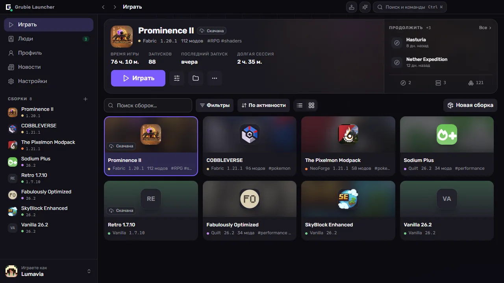
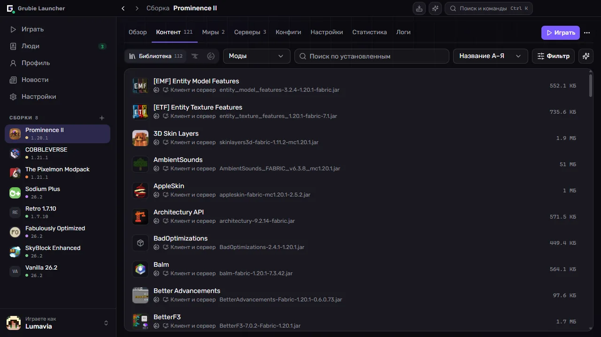
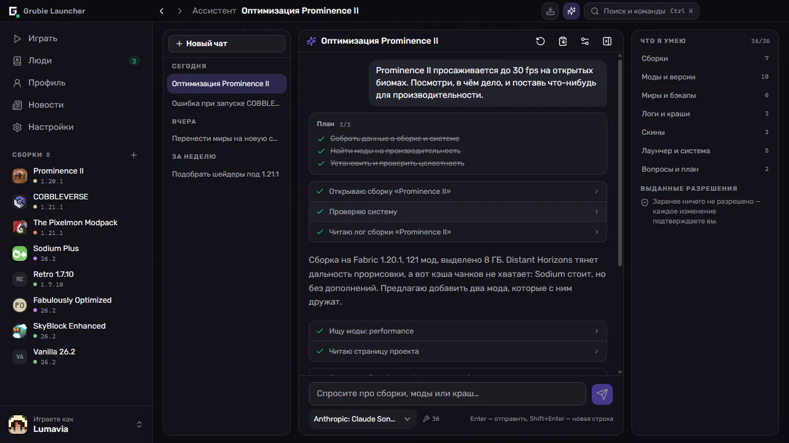
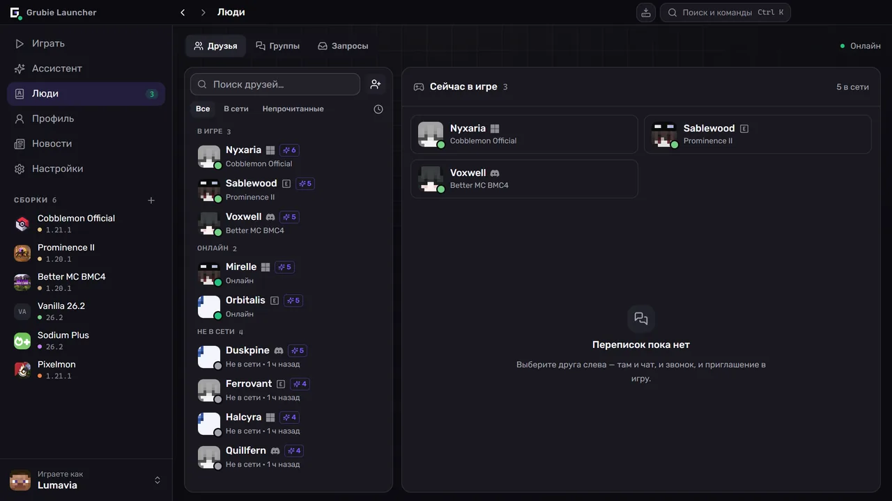

  

  <a href="https://grubielauncher.com/">grubielauncher.com</a>

  
  
  
   
  

---

# Grubie Launcher

Лаунчер Minecraft для Windows и Linux. Он ставит версии игры и загрузчики модов, сам скачивает подходящую Java и держит каждую сборку — моды, миры, конфиги, настройки запуска — в одном месте. От обычного лаунчера его отличают две вещи: когда игра падает, он читает crash-report и говорит, что именно сломалось, а друзья живут в том же окне — переписка, голос и вход в чужой мир без проброса портов и арендованного сервера.

Интерфейс — постоянная боковая панель и полноценные экраны вместо стопки диалогов. <kbd>Ctrl</kbd>+<kbd>K</kbd> открывает палитру команд, из которой доступны любая сборка, экран и настройка, <kbd>Ctrl</kbd>+<kbd>I</kbd> открывает ассистента, а <kbd>Alt</kbd>+<kbd>←</kbd> / <kbd>Alt</kbd>+<kbd>→</kbd> ходят по истории, как в браузере.

<kbd></kbd>
<kbd></kbd>

# Скриншоты

**Библиотека и сборка, в которую вы играли последней**

**Моды, ресурспаки и шейдеры — поиск прямо в лаунчере**

**Ассистент, который читает ваши сборки, логи и вылеты**

**Друзья, группы и заявки рядом с перепиской**

# Возможности

### Играть

- Официальные версии Minecraft: релизы, снапшоты и старые alpha/beta.
- Загрузчики модов: **Forge**, **NeoForge**, **Fabric**, **Quilt**.
- Java скачивается автоматически и подбирается под версию игры.
- Аккаунты: **Microsoft**, **Ely.by**, **Discord** и оффлайн. Несколько сразу, переключение из боковой панели.
- Библиотека сборок: список или сетка, группы, теги и заметки.
- Продолжить с того же места: запуск сразу в мир или на сервер прямо с экрана сборки.
- Память, флаги JVM и приоритет процесса задаются глобально, а для отдельной сборки их можно переопределить.
- Для сборки можно создать ярлык на рабочем столе.

### Сборки

- Моды, ресурспаки, шейдеры и датапаки из **CurseForge** и **Modrinth** — поиск и установка внутри лаунчера.
- Проверка обновлений сначала показывает разницу: что добавится, что обновится, что удалится.
- Импорт из файла: сборки Grubie, CurseForge, Modrinth (`.mrpack`), Prism и MultiMC — перетащите архив в окно.
- Экспорт сборки в архив: в копию попадают моды, конфиги и миры.
- Публикация сборки и код доступа: все, кто её установил, увидят ваше следующее обновление вместе со списком изменений и синхронизируют его в один клик.
- Каталог публичных сборок сообщества — и в самом лаунчере, и на [grubielauncher.com/packs](https://grubielauncher.com/packs).
- Проверка целостности: повреждённые и недостающие файлы скачиваются заново.
- Редактор конфигов с поиском, автодополнением и сохранёнными версиями, к которым можно откатиться.

### Вместе

- Друзья, заявки в друзья, личные сообщения и групповые чаты.
- Голос: комнаты в группах и звонки один на один, режим рации, шумоподавление, громкость по каждому участнику.
- **«Играть вместе»** — открыть мир, в котором вы сейчас находитесь, друзьям или всем, через интернет и без проброса портов.
- Вход в мир друга в один клик: лаунчер сам поставит и синхронизирует его сборку, а потом подключит вас.
- Приглашения в игру; уведомления в Telegram приходят, даже когда лаунчер закрыт.
- Discord Rich Presence со сборкой, в которую вы играете.
- Профиль с достижениями, статистикой и рейтингом. Достижения засчитываются и в мире друга.
- Скины и плащи: своя коллекция, импорт файлом, ссылкой или по нику, плюс каталог сообщества, куда можно опубликовать свой скин.

### Когда что-то ломается

- Карточка падения: лаунчер читает crash-report, называет вероятного виновника и что с этим делать. Правила приходят с сервера, поэтому улучшаются без обновления лаунчера.
- ИИ-разбор для падений, которые правила не узнали, — по вашему согласию, и перед отправкой из лога вырезаются пути, ники и токены.
- История запусков: каждый запуск со своим логом, поиском, кодом выхода и отчётом в один клик, который можно вставить в просьбу о помощи.
- Бэкапы миров: автоматические после сессии и ручные, а перед восстановлением снимается страховочная копия.
- Тест связи с сервисами лаунчера и официальными адресами Minecraft, CurseForge и Modrinth — помогает, когда провайдер что-то блокирует.
- Центр задач: установки и обновления с прогрессом, ошибками по каждому файлу и повтором.
- Загрузки могут идти через зеркало Grubie и сами возвращаются на официальный источник.

### Ассистент

- Работает на **вашем** провайдере и **вашем** ключе: любой OpenAI-совместимый эндпоинт, по умолчанию OpenRouter. Ключ остаётся на вашем компьютере.
- Читает то, что нужно для ответа: сборки, установленные моды, логи, последнее падение, миры, аккаунты, занятое место, сведения о системе.
- Действует за вас: создаёт сборки, ставит, обновляет, отключает и удаляет моды, меняет память и аргументы запуска, делает и восстанавливает бэкапы миров, выбирает скин, запускает игру.
- Спрашивает разрешения перед любым изменением, а на удаление спрашивает каждый раз заново — что бы вы ни разрешили раньше.
- История переписки синхронизируется с вашим аккаунтом Grubie; синхронизацию можно выключить в настройках.

### Свой сервер

- Сервер рядом со сборкой: **Vanilla**, **Spigot**, **Bukkit**, **Paper**, **Purpur**, **Forge**, **NeoForge**, **Fabric**, **Quilt**.
- Консоль, редактор `server.properties`, а моды и конфиги сервер берёт из своей сборки.

# Установка

1. Скачайте свежую сборку из [Releases](https://github.com/MOJI6416/grubielauncher/releases).
2. **Windows** — запустите установщик `-setup.exe`. **Linux** — запустите `.AppImage` или поставьте `.deb`.
3. Войдите в аккаунт или создайте оффлайн-профиль и выберите версию.

Лаунчер обновляется сам, переустанавливать его для новых версий не нужно.

# Лицензия

**MIT** — см. [LICENSE](../LICENSE).

# Ссылки

- **Сайт:** [grubielauncher.com](https://grubielauncher.com/)
- **Загрузки:** [Releases](https://github.com/MOJI6416/grubielauncher/releases)
- **История изменений:** [grubielauncher.com/changelog](https://grubielauncher.com/changelog)
- **Discord:** [сервер Grubie Launcher](https://discord.com/invite/URrKha9hk7)
- **Политика конфиденциальности:** [grubielauncher.com/privacy](https://grubielauncher.com/privacy)
