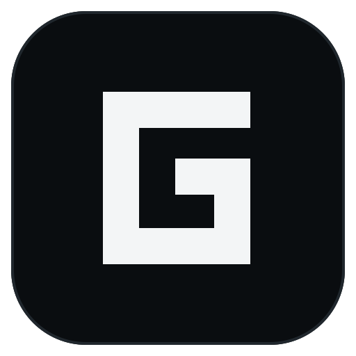

  

  <a href="https://grubielauncher.com/">grubielauncher.com</a>

  
  
  
   
  

---

# Про проєкт

**Grubie Launcher** — сучасний лаунчер для Minecraft з акцентом на зручність, соціальні можливості та керування збірками. Він допомагає встановлювати версії, керувати модами й світами, ділитися збірками та створювати сервери прямо з лаунчера.

<kbd></kbd>
<kbd></kbd>

# Можливості

- Встановлення та запуск **офіційних версій Minecraft**.
- Підтримка **Forge**, **Fabric**, **NeoForge** та **Quilt**.
- Автоматичне завантаження Java та залежностей.
- Підтримка кількох облікових записів: **Microsoft/Mojang**, **Ely.by**, **Discord** та офлайн.
- Зручне керування версіями, модами та світами.
- Інтеграція з **CurseForge** та **Modrinth**.
- Система скінів: Microsoft, Ely.by та **власні** скіни.
- Система друзів.
- Досягнення та внутрішня статистика гравця.
- Система публікації збірок: гравці вашої збірки автоматично отримують оновлення.
- Функція **«Відкрити доступ до світу»** через інтернет з режимами **public** і **friends**.
- Створення та керування сервером прямо з лаунчера. _Підтримувані ядра серверів: Vanilla, Spigot, Bukkit, Paper, Purpur, Forge, NeoForge, Fabric, Quilt._

# Встановлення та запуск

1. Завантажте останню версію з [Releases](https://github.com/MOJI6416/grubielauncher/releases).
2. Запустіть `grubie-launcher`.

_(Підтримувані платформи: Windows, Linux)_

# Ліцензія

Проєкт поширюється за ліцензією **MIT**.
