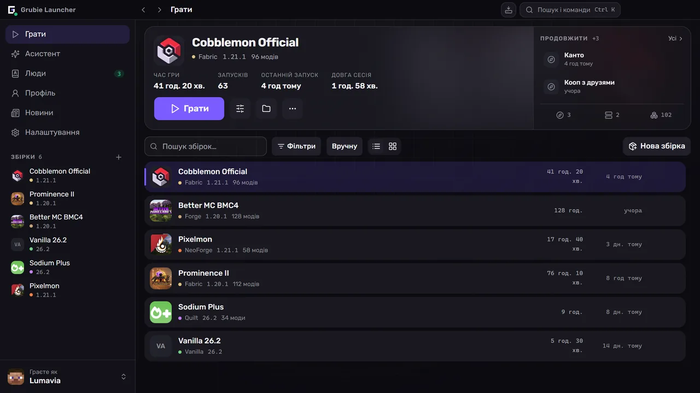
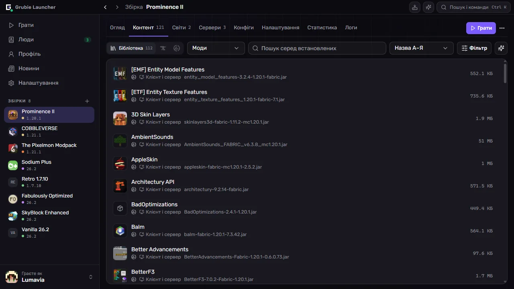
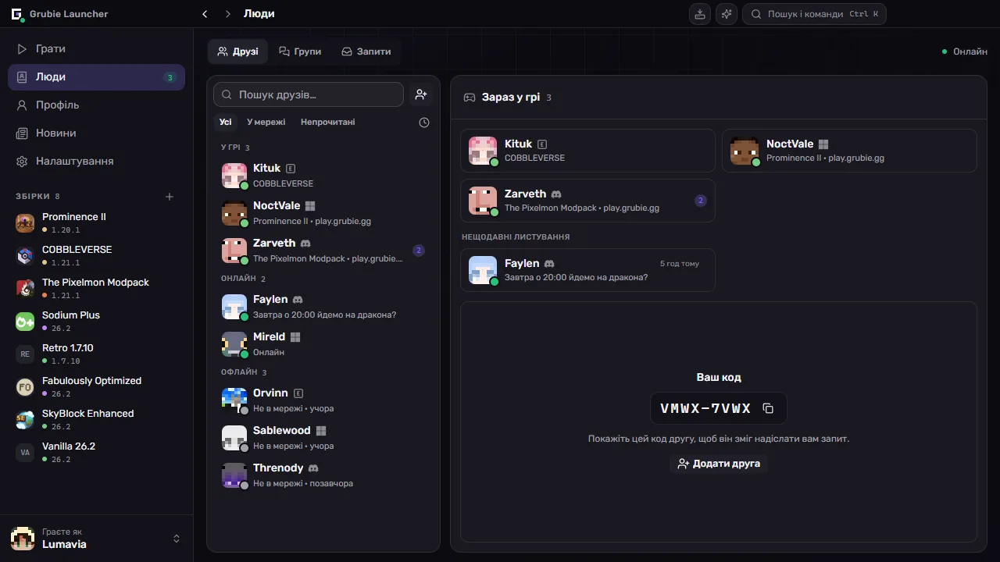

  

  <a href="https://grubielauncher.com/">grubielauncher.com</a>

  
  
  
   
  

---

# Grubie Launcher

Лаунчер Minecraft для Windows і Linux. Він встановлює версії гри та завантажувачі модів, сам завантажує потрібну Java і тримає кожну збірку — моди, світи, конфіги, налаштування запуску — в одному місці. Від звичайного лаунчера його відрізняють дві речі: коли гра падає, він читає crash-report і каже, що саме зламалося, а друзі живуть у тому самому вікні — листування, голос і вхід у чужий світ без прокидання портів та орендованого сервера.

Інтерфейс — постійна бічна панель і повноцінні екрани замість стосу діалогів. <kbd>Ctrl</kbd>+<kbd>K</kbd> відкриває палітру команд, з якої доступні будь-яка збірка, екран і налаштування, <kbd>Ctrl</kbd>+<kbd>I</kbd> відкриває асистента, а <kbd>Alt</kbd>+<kbd>←</kbd> / <kbd>Alt</kbd>+<kbd>→</kbd> ходять історією, як у браузері.

<kbd></kbd>
<kbd></kbd>

# Знімки екрана

**Бібліотека і збірка, у яку ви грали востаннє**

**Моди, ресурспаки та шейдери — пошук просто в лаунчері**

**Друзі, групи та заявки поруч із листуванням**

# Можливості

### Грати

- Офіційні версії Minecraft: релізи, снапшоти та старі alpha/beta.
- Завантажувачі модів: **Forge**, **NeoForge**, **Fabric**, **Quilt**.
- Java завантажується автоматично й добирається під версію гри.
- Акаунти: **Microsoft**, **Ely.by**, **Discord** та офлайн. Кілька одночасно, перемикання з бічної панелі.
- Бібліотека збірок: список або сітка, групи, теги та нотатки.
- Продовжити з того самого місця: запуск одразу у світ або на сервер просто з екрана збірки.
- Пам'ять, прапорці JVM і пріоритет процесу задаються глобально, а для окремої збірки їх можна перевизначити.
- Для збірки можна створити ярлик на робочому столі.

### Збірки

- Моди, ресурспаки, шейдери та датапаки з **CurseForge** і **Modrinth** — пошук та встановлення всередині лаунчера.
- Перевірка оновлень спершу показує різницю: що додасться, що оновиться, що зникне.
- Імпорт із файлу: збірки Grubie, CurseForge, Modrinth (`.mrpack`), Prism і MultiMC — перетягніть архів у вікно.
- Експорт збірки в архів: до копії потрапляють моди, конфіги та світи.
- Публікація збірки й код доступу: усі, хто її встановив, побачать ваше наступне оновлення разом зі списком змін і синхронізують його в один клік.
- Каталог публічних збірок спільноти — і в самому лаунчері, і на [grubielauncher.com/packs](https://grubielauncher.com/packs).
- Перевірка цілісності: пошкоджені та відсутні файли завантажуються заново.
- Редактор конфігів із пошуком, автодоповненням і збереженими версіями, до яких можна відкотитися.

### Разом

- Друзі, заявки в друзі, особисті повідомлення та групові чати.
- Голос: кімнати в групах і дзвінки віч-на-віч, режим рації, придушення шуму, гучність за кожним учасником.
- **«Грати разом»** — відкрити світ, у якому ви зараз перебуваєте, друзям або всім, через інтернет і без прокидання портів.
- Вхід у світ друга в один клік: лаунчер сам встановить і синхронізує його збірку, а потім підключить вас.
- Запрошення до гри; сповіщення в Telegram приходять, навіть коли лаунчер закритий.
- Discord Rich Presence зі збіркою, у яку ви граєте.
- Профіль із досягненнями, статистикою та рейтингом. Досягнення зараховуються й у світі друга.
- Скіни та плащі: власна колекція, імпорт файлом, посиланням або за ніком, плюс каталог спільноти, куди можна опублікувати свій скін.

### Коли щось ламається

- Картка падіння: лаунчер читає crash-report, називає ймовірного винуватця і що з цим робити. Правила приходять із сервера, тож покращуються без оновлення лаунчера.
- ШІ-розбір для падінь, які правила не впізнали, — за вашою згодою, і перед надсиланням із лога вирізаються шляхи, ніки та токени.
- Історія запусків: кожен запуск зі своїм логом, пошуком, кодом виходу та звітом в один клік, який можна вставити у прохання про допомогу.
- Резервні копії світів: автоматичні після сесії та ручні, а перед відновленням знімається страхувальна копія.
- Тест зв'язку із сервісами лаунчера та офіційними адресами Minecraft, CurseForge і Modrinth — допомагає, коли провайдер щось блокує.
- Центр задач: встановлення й оновлення з поступом, помилками за кожним файлом і повтором.
- Завантаження можуть іти через дзеркало Grubie і самі повертаються на офіційне джерело.

### Асистент

- Працює на **вашому** провайдері та **вашому** ключі: будь-який OpenAI-сумісний ендпоінт, типово OpenRouter. Ключ залишається на вашому комп'ютері.
- Читає те, що потрібно для відповіді: збірки, встановлені моди, логи, останнє падіння, світи, акаунти, зайняте місце, відомості про систему.
- Діє за вас: створює збірки, встановлює, оновлює, вимикає та видаляє моди, змінює пам'ять і аргументи запуску, робить і відновлює копії світів, обирає скін, запускає гру.
- Питає дозволу перед будь-якою зміною, а на видалення питає щоразу наново — хай що ви дозволили раніше.
- Історія листування синхронізується з вашим акаунтом Grubie; синхронізацію можна вимкнути в налаштуваннях.

### Власний сервер

- Сервер поруч зі збіркою: **Vanilla**, **Spigot**, **Bukkit**, **Paper**, **Purpur**, **Forge**, **NeoForge**, **Fabric**, **Quilt**.
- Консоль, редактор `server.properties`, а моди й конфіги сервер бере зі своєї збірки.

# Встановлення

1. Завантажте свіжу збірку з [Releases](https://github.com/MOJI6416/grubielauncher/releases).
2. **Windows** — запустіть інсталятор `-setup.exe`. **Linux** — запустіть `.AppImage` або встановіть `.deb`.
3. Увійдіть в акаунт або створіть офлайн-профіль і виберіть версію.

Лаунчер оновлюється сам, перевстановлювати його заради нових версій не потрібно.

# Ліцензія

**MIT** — див. [LICENSE](../LICENSE).

# Посилання

- **Сайт:** [grubielauncher.com](https://grubielauncher.com/)
- **Завантаження:** [Releases](https://github.com/MOJI6416/grubielauncher/releases)
- **Історія змін:** [grubielauncher.com/changelog](https://grubielauncher.com/changelog)
- **Discord:** [сервер Grubie Launcher](https://discord.com/invite/URrKha9hk7)
- **Політика конфіденційності:** [grubielauncher.com/privacy](https://grubielauncher.com/privacy)
